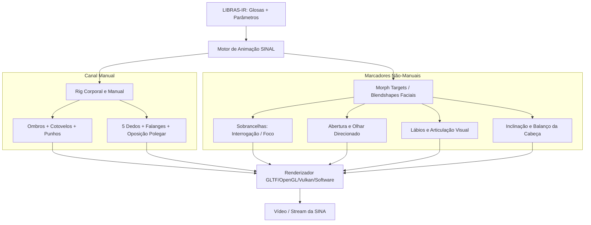

# SINA — Conceito visual e requisitos futuros do avatar (SINAL)

> A imagem de referência usada no design não é um asset 3D rigado e não está
> incluída no repositório. O renderer atual é procedural e não reproduz sua
> aparência. Esta página especifica o alvo; não descreve algo já implementado.

## 1. Identidade e Filosofia Visual

A **SINA** é a proposta de identidade visual do ecossistema **SINAL**. Seu
design deverá transmitir clareza, empatia, seriedade e naturalidade no território
do **semi-realismo humanizado**. Ela só poderá ser chamada de intérprete digital
depois de existir um rig adequado e movimentos de Libras revisados.

### Diretrizes de Design
- **Faixa etária aparente:** ~28 a 35 anos.
- **Expressão base:** Acolhedora, atenta, neutra e profissional.
- **Cabelo:** Preso em coque elegante ou corte estruturado que **nunca obstrui** testa, sobrancelhas, olhos, pescoço ou o espaço de sinalização frontal (*signing space*).
- **Vestimenta:** Blusa de manga longa / 3/4 em azul-marinho fosco ou cinza-escuro uniforme, sem estampas, golas volumosas ou reflexos especulares que possam competir visualmente com o movimento das mãos.
- **Anatomia:** Silhueta esguia e proporcional, com definição sutil de clavículas, ombros, cotovelos e punhos — **sem volumes arredondados ou corpos inflados**.

---

## 2. Requisitos Estruturais para Libras

A comunicação em Libras exige precisão simultânea em dois canais: **Manual** e **Não-Manual (Expressões)**.



### 2.1. Mãos e Configurações Manuais (CM)
- **5 dedos independentes**, cada um com suas 3 falanges articuladas (distal, média e proximal), e o polegar com 2 falanges + articulação carpometacarpal com amplitude de **oposição real**.
- Amplitude de abertura lateral (*abdução/adução*) e flexão precisa para reproduzir com fidelidade as configurações manuais do alfabeto datilológico e das glosas do inventário.

### 2.2. Marcadores Não-Manuais (MNM)
O modelo facial de produção deverá suportar **Blendshapes / Morph Targets**
compatíveis com *ARKit / FACS (Facial Action Coding System)*:
1. `browDownLeft` / `browDownRight` / `browInnerUp`: Indispensáveis para perguntas em Libras (WH-questions vs. Yes/No questions).
2. `eyeBlinkLeft` / `eyeBlinkRight` / `eyeWide`: Ênfase e pontuação visual.
3. `mouthSmile` / `mouthPucker` / `jawOpen` / `cheekPuff`: Morfologia e intensidade de ações/adjetivos em Libras.
4. `headPitch` / `headYaw` / `headRoll`: Concordância sintática e apontamento espacial.

---

## 3. Arquitetura Modular do SINAL

A camada de inteligência linguística do SINAL opera de forma **totalmente desacoplada** do modelo 3D:

```text
sinal/
 ├── libras/              # LIBRAS-IR, Tradutor Baseado em Regras, Glosador
 ├── language/            # Processamento de Português e Tokenização
 ├── animation/           # Solver de Poses, Interpolação e Espaço de Sinalização
 └── render/
      ├── core.py         # Interface base de renderização
      ├── synthetic.py    # Renderizador vetorial 2D (fallback)
      ├── three_d.py      # Renderizador geométrico procedural local
      └── gltf/           # Engine de Carregamento e Skinning 3D
           ├── loader.py  # Carregador de malhas e rigs GLTF / GLB
           ├── assets/
           │    ├── sina/ # Modelo oficial SINA (malha, texturas, rig, blendshapes)
           │    └── ...   # Avatares futuros plugáveis
           └── skinning.py# Deformação esquelética e blendshape blending
```

Essa separação garante que:
- Novos avatares (masculinos, estilos alternativos ou personalizáveis) possam ser adicionados simplesmente como pacotes de assets (`.glb` / `.gltf`).
- A lógica de tradução de Libras, validação de intervalos temporais e exportação de LIBRAS-IR permaneça 100% reutilizável e agnóstica de renderizador.
